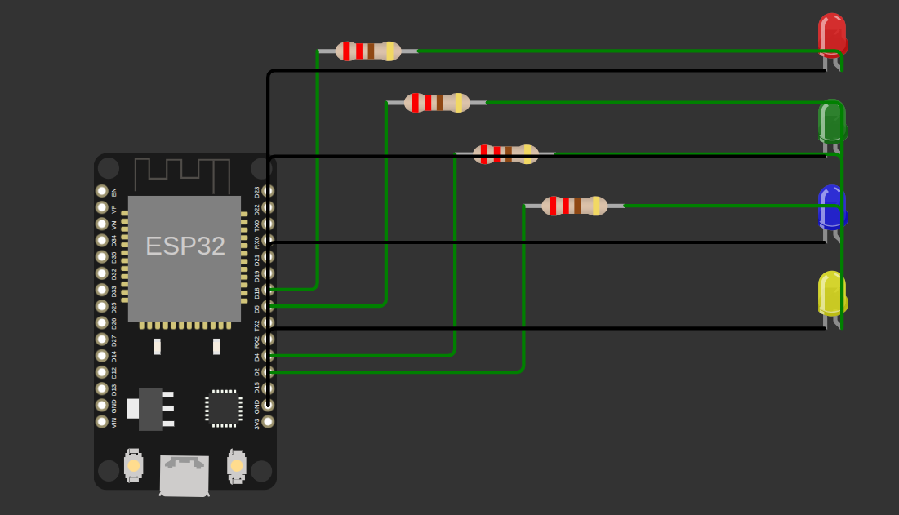

# SmartHomeOS

> Open-source smart home system built using ESP32, MQTT, Docker, and modern web technologies.

## Overview

SmartHomeOS is a smart home infrastructure project focused on:

- ESP32-based relay control
- MQTT communication
- Web dashboard
- Dockerized services
- Home automation

This repository will include both hardware and software required to build a complete smart home system.

---

## Planned Features

- Smart switch control
- Real-time device status
- Room-based appliance management
- MQTT communication
- ESP32 firmware
- Web dashboard
- Docker deployment
- Sensor integration
- Automation system

---

## Project Structure

```text
firmware/   → ESP32 code
backend/    → API server
dashboard/  → Web dashboard
hardware/   → Wiring and schematics
docker/     → Docker setup
docs/       → Documentation
```

---

## Status

🚧 Currently under development

V1 Goal:

- Control home appliances using ESP32 + relay module

---

## ESP32 LED Simulation (V1)

Initial ESP32 GPIO simulation created using Wokwi.

This simulation represents the first prototype of the SmartHomeOS relay control system.



## License

MIT
